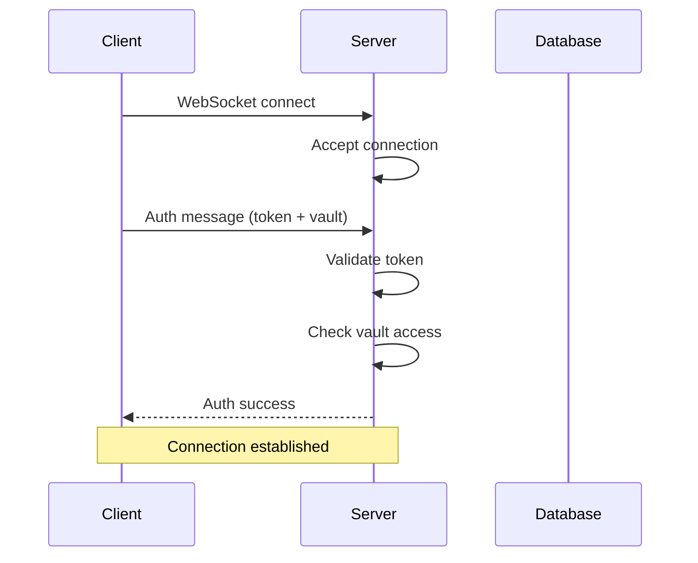
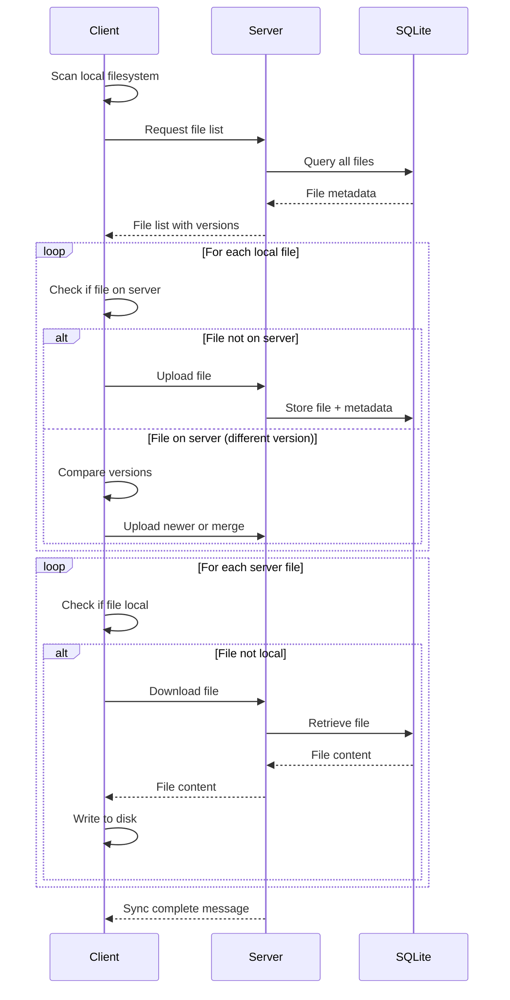
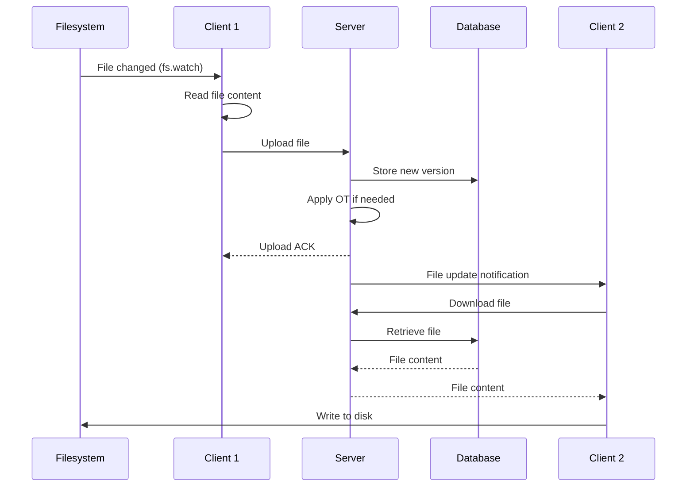

# Data Flow

This document provides a detailed look at how data flows through the VaultLink system, from client to server and back.

## Connection Lifecycle

### 1. Initial Connection



**Steps**:

1. Client initiates WebSocket connection to server
2. Server accepts connection
3. Client sends authentication message with token and vault name
4. Server validates token against `config.yml`
5. Server checks if user has access to requested vault
6. Server responds with success or error
7. Connection is ready for syncing

### 2. Initial Sync

After authentication, the client performs initial synchronization:



**Process**:

1. Client scans local filesystem
2. Client requests file list from server
3. Server queries database and returns metadata
4. Client uploads missing or changed local files
5. Client downloads missing files from server
6. Server sends sync complete notification

### 3. Real-Time Synchronization

After initial sync, changes are pushed in real-time:



**Flow**:

1. Filesystem watcher detects local change
2. Client reads file content
3. Client uploads file via WebSocket
4. Server stores in database
5. Server applies operational transformation if concurrent edits
6. Server acknowledges upload to sender
7. Server broadcasts update to other clients
8. Other clients download and apply changes

## File Operations

### Upload

```
┌─────────┐
│ Client  │
└────┬────┘
     │ 1. Detect file change
     │
     ├─► 2. Read file content
     │
     ├─► 3. Create upload message
     │    {
     │      type: "upload_file",
     │      path: "notes/daily.md",
     │      content: "...",
     │      version: 42,
     │      timestamp: "2024-01-01T12:00:00Z"
     │    }
     │
     ▼
┌─────────┐
│ Server  │
└────┬────┘
     │ 4. Validate message
     │
     ├─► 5. Check permissions
     │
     ├─► 6. Apply OT (if conflicts)
     │
     ├─► 7. Store in database
     │
     ├─► 8. Update version
     │
     ├─► 9. Broadcast to clients
     │
     └─► 10. Send ACK to uploader
```

### Download

```
┌─────────┐
│ Server  │
└────┬────┘
     │ 1. File updated by another client
     │
     ├─► 2. Broadcast notification
     │    {
     │      type: "file_updated",
     │      path: "notes/daily.md",
     │      version: 43
     │    }
     │
     ▼
┌─────────┐
│ Client  │
└────┬────┘
     │ 3. Receive notification
     │
     ├─► 4. Request file download
     │    {
     │      type: "download_file",
     │      path: "notes/daily.md",
     │      version: 43
     │    }
     │
     ▼
┌─────────┐
│ Server  │
└────┬────┘
     │ 5. Retrieve from database
     │
     └─► 6. Send file content
          {
            type: "file_content",
            path: "notes/daily.md",
            content: "...",
            version: 43
          }
          │
          ▼
     ┌─────────┐
     │ Client  │
     └────┬────┘
          │ 7. Write to filesystem
          │
          └─► 8. Update local metadata
```

### Delete

```
┌─────────┐
│ Client  │
└────┬────┘
     │ 1. File deleted locally
     │
     ├─► 2. Send delete message
     │    {
     │      type: "delete_file",
     │      path: "notes/old.md"
     │    }
     │
     ▼
┌─────────┐
│ Server  │
└────┬────┘
     │ 3. Mark as deleted in DB
     │    (soft delete for history)
     │
     ├─► 4. Broadcast deletion
     │
     └─► 5. ACK to sender
          │
          ▼
     ┌─────────┐
     │ Other   │
     │ Clients │
     └────┬────┘
          │ 6. Delete local file
          │
          └─► 7. Update metadata
```

## Conflict Resolution Flow

### Concurrent Edits Scenario

```
Time →

Client A                    Server                      Client B
   │                          │                            │
   │ Edit file v10            │                            │
   │ "Add line A"             │                            │ Edit file v10
   │                          │                            │ "Add line B"
   │                          │                            │
   ├─── Upload @ t1 ─────────►│                            │
   │                          │◄────── Upload @ t2 ────────┤
   │                          │                            │
   │                          │ 1. Receive both edits      │
   │                          │    (based on v10)          │
   │                          │                            │
   │                          │ 2. Apply first edit        │
   │                          │    → v11 (line A added)    │
   │                          │                            │
   │                          │ 3. Transform second edit   │
   │                          │    against first           │
   │                          │                            │
   │                          │ 4. Apply transformed edit  │
   │                          │    → v12 (both lines)      │
   │                          │                            │
   │◄──── v12 content ────────┤                            │
   │                          ├───── v12 content ─────────►│
   │                          │                            │
   │ Apply v12                │                            │ Apply v12
   │ (has both lines)         │                            │ (has both lines)
   │                          │                            │
```

### Conflict Resolution Steps

1. **Detection**: Server receives two edits based on the same version
2. **Ordering**: Determine which edit to apply first (by timestamp or client ID)
3. **First edit**: Apply directly to database
4. **Transformation**: Transform second edit against first using OT
5. **Second edit**: Apply transformed edit to database
6. **Broadcast**: Send merged result to all clients
7. **Application**: Clients apply merged version locally

## Database Schema

### Core Tables

```sql
-- Document metadata
CREATE TABLE documents (
    id INTEGER PRIMARY KEY,
    path TEXT NOT NULL,
    version INTEGER NOT NULL,
    content_hash TEXT,
    size INTEGER,
    created_at TIMESTAMP,
    updated_at TIMESTAMP,
    deleted BOOLEAN DEFAULT FALSE
);

-- Version history
CREATE TABLE versions (
    id INTEGER PRIMARY KEY,
    document_id INTEGER,
    version INTEGER,
    content BLOB,
    created_at TIMESTAMP,
    FOREIGN KEY (document_id) REFERENCES documents(id)
);

-- Client sync cursors
CREATE TABLE cursors (
    client_id TEXT PRIMARY KEY,
    last_version INTEGER,
    last_updated TIMESTAMP
);
```

### Queries

**Get files since version**:

```sql
SELECT * FROM documents
WHERE version > ? AND deleted = FALSE
ORDER BY version ASC;
```

**Store new version**:

```sql
INSERT INTO versions (document_id, version, content, created_at)
VALUES (?, ?, ?, ?);

UPDATE documents
SET version = ?, updated_at = ?
WHERE id = ?;
```

**Update cursor**:

```sql
INSERT OR REPLACE INTO cursors (client_id, last_version, last_updated)
VALUES (?, ?, ?);
```

## Message Protocol

### Client → Server Messages

**Upload File**:

```json
{
	"type": "upload_file",
	"path": "notes/example.md",
	"content": "File content here...",
	"base_version": 10,
	"timestamp": "2024-01-01T12:00:00Z"
}
```

**Download File**:

```json
{
	"type": "download_file",
	"path": "notes/example.md"
}
```

**Delete File**:

```json
{
	"type": "delete_file",
	"path": "notes/old.md"
}
```

**List Files**:

```json
{
	"type": "list_files",
	"since_version": 0
}
```

### Server → Client Messages

**File Updated**:

```json
{
	"type": "file_updated",
	"path": "notes/example.md",
	"version": 11,
	"size": 1024,
	"hash": "abc123..."
}
```

**File Content**:

```json
{
	"type": "file_content",
	"path": "notes/example.md",
	"content": "Updated content...",
	"version": 11
}
```

**File Deleted**:

```json
{
	"type": "file_deleted",
	"path": "notes/old.md",
	"version": 12
}
```

**Sync Complete**:

```json
{
	"type": "sync_complete",
	"total_files": 150,
	"current_version": 200
}
```

**Error**:

```json
{
	"type": "error",
	"message": "File too large",
	"code": "FILE_TOO_LARGE"
}
```

## Error Handling

### Client-Side Errors

**Network failure**:

1. Detect WebSocket disconnect
2. Queue pending operations
3. Retry connection with exponential backoff
4. Replay queued operations on reconnect

**File read error**:

1. Log error
2. Skip file
3. Continue with other files
4. Report to user

**Write conflict**:

1. Receive updated version from server
2. Apply OT merge locally
3. Overwrite local file
4. Continue syncing

### Server-Side Errors

**Database error**:

1. Log error
2. Return error to client
3. Client retries operation

**Invalid operation**:

1. Validate message format
2. Return specific error code
3. Client handles error appropriately

**Authentication failure**:

1. Reject connection
2. Send auth error
3. Client prompts for new credentials

## Performance Optimizations

### Batching

- Small, rapid changes are batched together
- Reduces message overhead
- Applied as single atomic update

### Compression

- Large files compressed before transmission
- Reduces bandwidth usage
- Transparent to application layer

### Incremental Sync

- Only changed portions of files sent
- Uses content-based diffing
- Significantly reduces data transfer

### Caching

- Server caches recent file versions
- Reduces database queries
- Improves response time

## Monitoring Data Flow

### Server Logs

```
2024-01-01 12:00:00 INFO WebSocket connection from 192.168.1.100
2024-01-01 12:00:01 INFO User 'alice' authenticated for vault 'personal'
2024-01-01 12:00:05 INFO Upload: notes/daily.md (v10 -> v11)
2024-01-01 12:00:06 INFO Broadcast to 3 clients
2024-01-01 12:00:10 INFO Conflict resolved: notes/shared.md (v12)
```

### Client Logs

```
2024-01-01 12:00:00 INFO Connecting to ws://sync.example.com
2024-01-01 12:00:01 INFO Connected, authenticating...
2024-01-01 12:00:01 INFO Authentication successful
2024-01-01 12:00:02 INFO Starting initial sync
2024-01-01 12:00:10 INFO Sync complete: 150 files, 200 MB
2024-01-01 12:00:15 INFO Uploaded: notes/daily.md
2024-01-01 12:00:20 INFO Downloaded: notes/shared.md (merged)
```

## Next Steps

- [Understand the sync algorithm →](/architecture/sync-algorithm)
- [Configure the server →](/config/server)
- [Deploy VaultLink →](/guide/getting-started)
